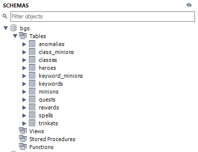
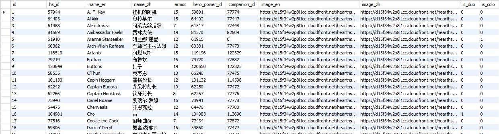
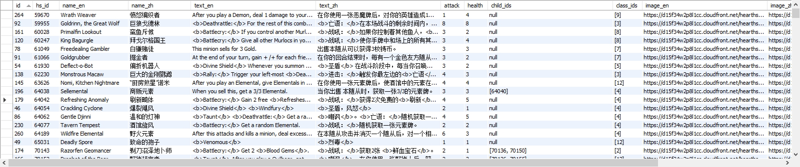
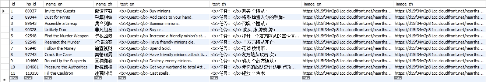

# Hearthstone Battlegrounds Backend Server

A High-Performance Encyclopedia Backend for Hearthstone Battlegrounds

---

## 🖼 Example Screenshots

Sample data structures and UI previews (from the `/examples/` folder):






---

## 🌟 Project Overview

This project is a backend server written in **Go** designed to power a fully customized **Hearthstone: Battlegrounds encyclopedia**.
Compared with the official Blizzard website, this project focuses on:

* **Faster and more flexible data retrieval**
* **A cleaner and more intuitive user experience (frontend coming soon)**
* **Richer metadata and structured JSON fields**
* **Developer-friendly REST APIs**

The backend automatically fetches all Battlegrounds-related data from the **Blizzard Hearthstone API** and stores it in a **MySQL** database using GORM.

Core data types currently supported:

* Heroes
* Minions
* Spells
* Quests
* Anomalies
* Rewards
* Trinkets (Greater / Lesser)

This repository is the backend foundation for a future complete Battlegrounds encyclopedia website.

---

## 🚀 Features

### ✅ Completed

* Full synchronization pipeline with Blizzard’s Hearthstone API
* Automated fetching of all Battlegrounds card types
* MySQL database storage using GORM
* JSON-based fields for tribes, child IDs, keywords, etc.
* Robust English + Chinese metadata support
* Clean and extensible data models
* Fully automated data refresh workflow

### 🔧 In Development

* REST API for search and filtering
* Minion filtering by tier, tribe, keywords, etc.
* Hero filtering by armor, buddy, power type
* Pagination and sorting
* Frontend integration (React / Vue)

### 🎯 Planned Features

* Image CDN proxy and caching layer
* Advanced search (e.g., “Minions with Keyword X”)
* User favorites + cloud sync
* Docker one-click deployment
* Cloudflare Tunnel support for secure public access

---

## 🛠 Tech Stack

* **Go 1.22+**
* **Gin** — HTTP framework
* **GORM** — ORM for database models
* **MySQL 8.0** — Primary database
* **godotenv** — Environment configuration
* **Blizzard Hearthstone API** — Official data provider

---

## 📦 Installation

Install project dependencies:

```bash
go get github.com/gin-gonic/gin
go get gorm.io/gorm
go get gorm.io/driver/mysql
go get github.com/joho/godotenv
go get gorm.io/datatypes
```

---

## ⚙️ Environment Variables

Create a `.env` file in the root directory:

```env
BLIZZARD_CLIENT_ID=your_client_id
BLIZZARD_CLIENT_SECRET=your_client_secret
OAUTH_URL=https://oauth.battle.net/token

DB_USER=root
DB_PASS=123456
DB_HOST=127.0.0.1
DB_PORT=3306
DB_NAME=bgs
```

---

## 🔗 Blizzard API Endpoints Used

### **Minions**

```
https://us.api.blizzard.com/hearthstone/cards?bgCardType=minion&gameMode=battlegrounds
```

### **Heroes**

```
https://us.api.blizzard.com/hearthstone/cards?type=hero&gameMode=battlegrounds
```

### **Spells**

```
https://us.api.blizzard.com/hearthstone/cards?bgCardType=spell&gameMode=battlegrounds
```

### **Quests**

```
https://us.api.blizzard.com/hearthstone/cards?type=spell&gameMode=battlegrounds&sort=quest
```

### **Anomalies**

```
https://us.api.blizzard.com/hearthstone/cards?bgCardType=anomaly&gameMode=battlegrounds
```

### **Rewards**

```
https://us.api.blizzard.com/hearthstone/cards?bgCardType=reward&gameMode=battlegrounds
```

### **Trinkets**

```
https://us.api.blizzard.com/hearthstone/cards?type=trinket&gameMode=battlegrounds
```

---

## 📁 Project Structure

```plaintext
.
├── cmd/
│   └── main.go            # Main sync workflow
├── blizzard/
│   └── blizzard.go        # Blizzard API client
├── database/
│   └── database.go        # Database initialization + AutoMigrate
├── models/
│   ├── heroes.go
│   ├── minions.go         # JSON-based minion model
│   ├── anomalies.go
│   ├── rewards.go
│   ├── quests.go
│   └── spells.go
├── examples/              # Preview images
├── go.mod
├── go.sum
└── README.md
```

---

## 📌 Roadmap

* [ ] Add `/api/v1/minions` endpoint
* [ ] Add filtering: tier, tribe, keyword, spellSchool
* [ ] Add full hero search endpoint
* [ ] Add web dashboard
* [ ] Add Redis caching for faster performance
* [ ] Docker deployment + Cloudflare Tunnel support

---

## 📄 License

MIT License © 2025 ZEXIANG ZHANG

---

## 🤝 Contributions

Contributions, issues, and PRs are welcome.
Let's make this the **best Battlegrounds encyclopedia platform** available.
